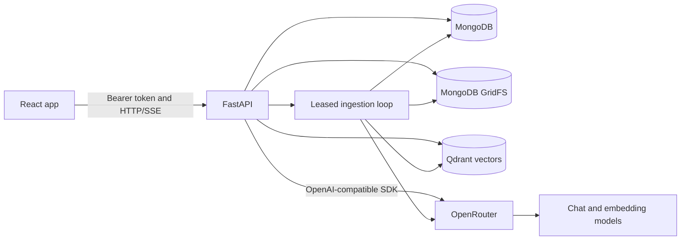

# Architecture and data boundaries

## System overview

The React client handles routing, session state, document UI, streaming event parsing, and document viewers. FastAPI owns identity checks, document lifecycle, extraction, indexing, retrieval, conversation persistence, citation verification, comparison, research, and redline generation. MongoDB is the application record store. Qdrant is a derived search index and can be rebuilt from stored source files and extracted text.

## Upload and indexing

1. An authenticated upload is validated by extension, file signature, size, and per-account document limit.
2. The original bytes are saved to MongoDB GridFS. A MongoDB document record stores ownership, filename, status, progress, version, and file reference.
3. A worker claims the queued record with an expiring lease and heartbeat.
4. PyMuPDF extracts PDF text with page anchors. `python-docx` extracts DOCX paragraphs and tables with block anchors. The canonical text and extracted outline are saved with the document.
5. Text is split into overlapping location-aware chunks. The OpenAI SDK calls the configured embedding model through OpenRouter.
6. Qdrant stores vectors and payloads containing the user, document, index version, chunk text, and source offsets.
7. The document status becomes `ready` only after vector writes succeed.

## Authentication and ownership

The API validates signed bearer tokens and resolves the user from the token subject. It does not trust a client-supplied owner ID. Document reads and writes query MongoDB by both `document_id` and the authenticated `owner_id`.

Qdrant is a shared collection. Every search, scroll, and delete uses a centralized filter for `owner_id` and `document_id`, plus `active` and `index_version` where relevant. The backend checks the payload and validates each selected chunk against canonical text before passing it to chat. These checks prevent stale points or cross-account matches from becoming model context.

## Chat and answer streaming

The chat endpoint creates or reuses a conversation scoped to one document, loads a bounded set of prior messages, and chooses a retrieval mode from the question. Focused questions use vector similarity. Broad questions scroll the document's indexed chunks and choose distributed evidence. Contents questions search chunks associated with the extracted contents text. If normal retrieval produces no useful evidence for an eligible question, a bounded document fallback can be used.

The model response is streamed as server-sent events. Final citation candidates are normalized and verified against canonical extracted text. The database stores the answer status, citations, and retrieval coverage so history can be reopened.

## Additional analysis paths

- **Comparison:** analyzes two owned, ready documents, aligns contract sections, classifies changes, and supports a comparative chat question across the pair.
- **Agent research:** exposes a bounded set of tools that search and inspect one selected document. Tool arguments are validated, rounds are capped, and final source quotes are verified.
- **Redline:** proposes a textual edit and returns a DOCX with OpenXML insertion and deletion markers. For a PDF source, a new DOCX is built from extracted text, so the original layout cannot be preserved.

## Failure boundaries

- MongoDB is required for authentication, document metadata, source files, and chat history.
- Qdrant or model-provider failures prevent indexing or retrieval; the API reports processing or answer errors instead of treating a missing index as a ready document.
- A process interruption can leave an ingestion lease; the worker can reclaim it after expiry.
- Upload and extraction limits guard memory and database document size. Scanned PDFs need OCR before they can be searched; OCR is not included.
- Qdrant contents are derived data. Re-indexing must keep index versions aligned with document metadata.

## Relevant code

- `backend/app/main.py` — service lifespan, MongoDB indexes, router setup, and worker startup.
- `backend/app/routers/` — HTTP endpoints and authorization orchestration.
- `backend/app/services/extraction.py`, `chunking.py`, `ingestion.py` — source processing.
- `backend/app/services/qdrant_repository.py` — Qdrant client, payload filters, and point creation.
- `backend/app/services/citations/` — citation location and verification.
- `frontend/src/App.tsx` — routes, session restore, and protected pages.
